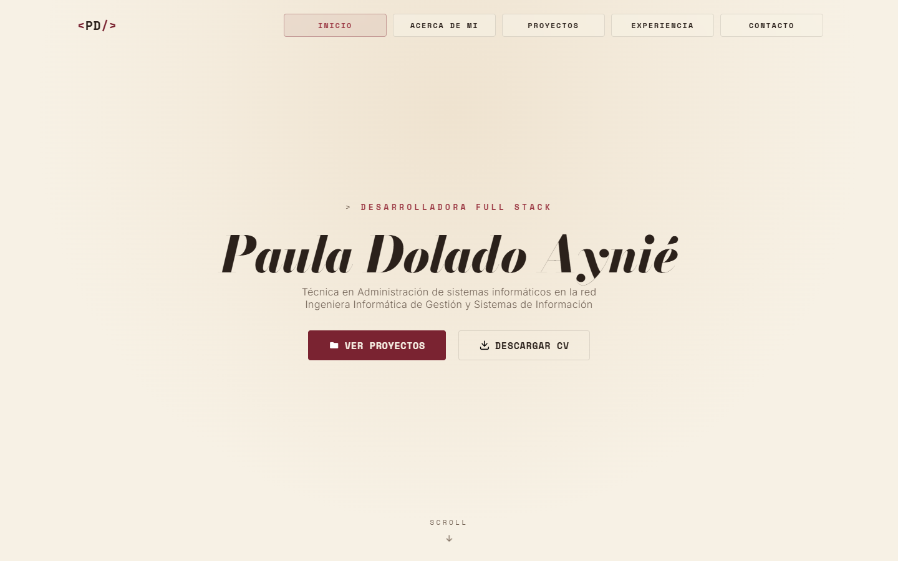

<div align="center">

# 👩‍💻 Paula Dolado Aynié

**Portfolio personal: Desarrolladora Full Stack e Ingeniera Informática. Proyectos, experiencia y contacto en una sola página.**

[](https://github.com/PaulaDolado/pauladolado.github.io/actions/workflows/pages/pages-build-deployment)


[**🔗 Sitio en vivo**](https://pauladolado.github.io/)



</div>

## Contenido

Sitio de una sola página (SPA estática) con las siguientes secciones:

- **Inicio** — presentación y accesos directos a proyectos y CV.
- **Acerca de mí** — perfil, habilidades blandas y técnicas.
- **Proyectos** — carrusel de tarjetas con los proyectos desarrollados.
- **Experiencia** — línea de tiempo de trayectoria profesional.
- **Contacto** — formulario de contacto y enlaces a redes.

## Tecnología

Sitio estático sin build ni framework: HTML, CSS y JavaScript puro (vanilla).

- **[GSAP](https://gsap.com/)** (`ScrollTrigger`, `SplitText`) — animaciones de scroll, texto y el carrusel de proyectos pineado.
- **[Lenis](https://github.com/darkroomengineering/lenis)** — scroll suave.
- **[FormSubmit](https://formsubmit.co/)** — envío del formulario de contacto sin backend propio.

Todas las librerías se cargan desde CDN (jsDelivr) directamente en [`index.html`](index.html); no hay `package.json` ni dependencias que instalar.

## Estructura del proyecto

```
├── index.html              # Punto de entrada, contenido y secciones
├── css/
│   └── styles.css          # Estilos y responsive (móvil / portátil / escritorio)
├── script.js                # Animaciones generales (menú, scroll, cursor)
├── ScriptsJS/
│   ├── animaciongaleria.js  # Carrusel pineado de proyectos + contador
│   ├── animacionMaqEscrib.js# Efecto máquina de escribir
│   ├── formulario.js        # Lógica del formulario de contacto
│   ├── menu.js              # Menú de navegación (móvil y scroll activo)
│   ├── proyectoModal.js     # Modal «Más información» de cada proyecto
│   ├── proyectoVideo.js     # Vídeo de vista previa en las tarjetas de proyecto
│   └── skillsToggle.js      # Toggle de habilidades técnicas
├── img/                     # Imágenes e iconos
└── docs/
    └── CV_PaulaDolado.pdf   # CV descargable
```

## Desarrollo local

No requiere instalación de dependencias. Basta con servir la carpeta con cualquier servidor estático, por ejemplo:

```bash
python -m http.server 8000
```

y abrir `http://localhost:8000` en el navegador.

> Abrir `index.html` directamente con `file://` no es recomendable: algunas rutas relativas y comportamientos de scroll pueden no funcionar igual que servidos por HTTP.

## Despliegue

El sitio se publica automáticamente con **GitHub Pages** desde la rama `main`.

## Contacto

- LinkedIn: [Paula Dolado Aynié](https://www.linkedin.com/in/paula-dolado-ayni%C3%A9/)
- GitHub: [@PaulaDolado](https://github.com/PaulaDolado)
